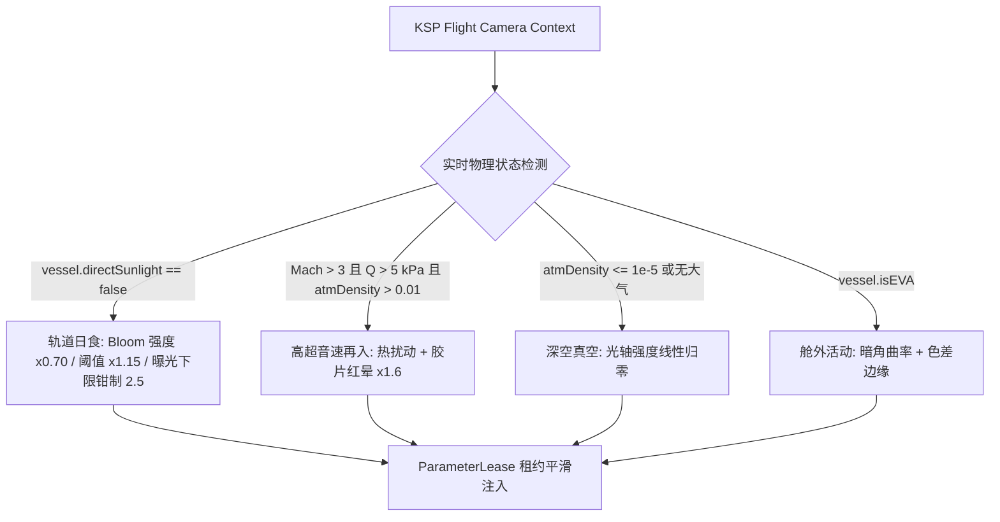

# TUFX Next-Gen Advanced Visual Effects Suite (`feature/advanced-effects`)
## 次时代影视级后处理系统技术规格与开发者文档

> **分支代码库**：[shadowmage45/TUFX](https://github.com/shadowmage45/TUFX) (`feature/advanced-effects`)  
> **适用平台**：Kerbal Space Program 1 (KSP 1.12.x / Unity 2019.4.18f1 / DirectX 11 SM5.0 / OpenGL / Vulkan)  
> **星系尺度兼容**：Stock 坎原版体系、RSS (Real Solar System 1:1真实太阳系)、RO/RP-1、JNSQ (2.7x)、Beyond Home、Parallax 2、Scatterer、EVE Redux、Deferred Shading (Blackrack)  
> **开源算法许可**：MIT License / Apache 2.0 / BSD 3-Clause  
> **更新日期**：2026年9月

---

## 目录 (Table of Contents)

1. [项目背景与设计哲学 (Overview & Design Philosophy)](#1-项目背景与设计哲学)
2. [核心技术剖析与算法实现 (Technical Deep-Dive)](#2-核心技术剖析与算法实现)
   * [2.1 Intel XeGTAO (次时代地面真实环境光遮蔽 - 官方移植与崩溃根治)](#21-intel-xegtao-次时代地面真实环境光遮蔽)
   * [2.2 Intel CMAA 2 (保守形态学抗锯齿 2.0 - 零残影航天级抗锯齿)](#22-intel-cmaa-2-保守形态学抗锯齿-20)
   * [2.3 AMD FidelityFX FSR 1.0 / CAS (对比度自适应动态锐化与 AA 协同管线)](#23-amd-fidelityfx-fsr-10--cas-对比度自适应动态锐化)
   * [2.4 Modern Tonemapping (现代化电影级色调映射 - AgX / ACES / Tony McMapface / Filmic)](#24-modern-tonemapping-现代化电影级色调映射)
   * [2.5 Screen Space Contact Shadows (屏幕空间微距接触阴影)](#25-screen-space-contact-shadows-屏幕空间微距接触阴影)
   * [2.6 Screen Space God Rays & Volumetric Shadows (体积光轴与飞船背光阴影)](#26-screen-space-god-rays--volumetric-shadows-体积光轴与飞船背光阴影)
   * [2.7 Film Halation (胶片红晕与化学漫射)](#27-film-halation-胶片红晕与化学漫射)
   * [2.8 Anamorphic Lens Flare & Starburst (变形宽银幕光斑与恒星衍射星芒)](#28-anamorphic-lens-flare--starburst-变形宽银幕光斑与恒星衍射星芒)
   * [2.9 Spectral Bokeh (光谱色散色差景深)](#29-spectral-bokeh-光谱色散色差景深)
   * [2.10 Screen Space Reflections (SSR 屏幕空间反射与延迟渲染直通)](#210-screen-space-reflections-ssr-屏幕空间反射与延迟渲染直通)
   * [2.11 Heat Distortion & Atmospheric Shimmer (超高音速再入激波与火箭尾焰热扰动)](#211-heat-distortion--atmospheric-shimmer-超高音速再入激波与火箭尾焰热扰动)
   * [2.12 确定性效果执行顺序 (Deterministic Effect Ordering)](#212-确定性效果执行顺序-deterministic-effect-ordering)
3. [自主环境自适应系统 (Autonomous Dynamic Context Manager)](#3-自主环境自适应系统)
4. [全星系全尺度自适应几何投影机制 (Scale-Independent Projection Metric)](#4-全星系全尺度自适应几何投影机制)
5. [交互式控制中心 (ExtendFX ★ UI 架构与抗锯齿控制面板)](#5-交互式控制中心-extendfx--ui-架构)
6. [预设规范与配置字典 (Configuration Node Specification & Presets)](#6-预设规范与配置字典)
7. [源码构建与自动化部署手册 (Build & Deployment Pipeline)](#7-源码构建与自动化部署手册)
8. [技术常见问答与故障排查 (Troubleshooting & Technical FAQ)](#8-技术常见问答与故障排查)

---

## 1. 项目背景与设计哲学

TUFX（Textures Unlimited FX）是坎巴拉太空计划（KSP）中基于 Unity Post-Processing Stack v2 的后处理渲染中间件。

长期以来，KSP 玩家与电影级航天模拟作者面临着几个关键的画质与体验瓶颈：
1. **对比度发灰与过曝（HDR Tone Curve Clipping）**：原版 Unity 提供的 Neutral 与早期 ACES 算法在面对深空无散射纯黑背景与太阳直接照射的极高对比（Dynamic Range > 100,000:1）时，容易造成高光色彩坍缩（地球云层发白、没有细节层次）或暗部泛灰发白；
2. **抗锯齿与拖影两难抉择（The Temporal Smearing Dilemma）**：
   - 开启时间抗锯齿（TAA）时，由于 KSP 前向渲染（Forward Rendering）管线中网格缺少每像素运动矢量（Motion Vectors 通常为 0），当航天器以数千米每秒高速飞行或变轨翻滚时，TAA 会将运动像素误判为“静止”像素，进行 90%~95% 的历史帧混合，导致极为严重的**黑色拖尾、重影与模糊**；
   - 单纯使用 AMD FSR 1.0 CAS 锐化滤镜时，由于其本质是高频边缘反差提升算法，缺少底层平滑过滤时，反而会将几何物体的台阶锯齿进一步锐化，产生严重的像素噪点；
3. **接触阴影与微观自遮挡缺失**：传统 SSAO 对大尺度有效，但在航天器对接机构、太阳翼合页、发动机喷管基座等微观缝隙处缺乏物理深度；而级联阴影贴图（Shadow Maps）受限于精度，在零件接合处常出现悬浮感（Peter Panning）；
4. **硬编码尺度缺陷**：原有后处理多假设场景深度在数百米以内，在 1:1 真实太阳系（RSS 地球半径 6,371 km）或原版大比例尺远景中，容易出现天体几何穿模、全屏噪波闪烁或地表异常暗斑。

本分支 `feature/advanced-effects` 的核心目标，是**将现代业界顶尖的开源图形学算法（Intel XeGTAO、Intel CMAA 2、AMD FidelityFX FSR 1.0 CAS、Blender 4.x AgX 色彩科学）完整引入 TUFX**，并设计了尺度无关的几何投影体系与抗锯齿控制中心，实现零崩溃、零残影、4K 通透质感的真实太空视觉。

> **实现保真度声明（请先读这一段）**：本分支的着色器分两档。
> * **保真度移植档**：Intel XeGTAO —— 逐函数对译官方 `XeGTAO.hlsli` 的边权重、法线重建、地平线积分与 multi-bounce，是本套件中唯一可以直接与官方源码对照的效果。
> * **原理复现档**：Intel CMAA 2、AMD FSR 1.0 CAS、AgX/Tony McMapface 等 —— 按官方论文/参考实现的**算法思想自行编写 HLSL**，为单 Pass、适配 Unity PostProcessing Stack 的精简形态，**不是官方源码的逐行移植**，也不追求与官方相同的 pass 结构。各自的开源许可与出处均在着色器文件头部标注。
>
> 因此请把本文档中「移植」「官方」等措辞理解为"采用官方算法"，而非"官方代码原样搬运"。

---

## 2. 核心技术剖析与算法实现

### 2.1 Intel XeGTAO (次时代地面真实环境光遮蔽)
* **着色器路径**：`Unity/Assets/Shaders/TUFX/GroundTruthAO.shader`
* **C# 驱动类**：[`GroundTruthAO.cs`](file:///c:/Users/43701/Documents/github/TUFX/Plugin/TUFX/PostProcessing/Effects/GroundTruthAO.cs)
* **官方开源仓库**：[`GameTechDev/XeGTAO`](https://github.com/GameTechDev/XeGTAO) (MIT License)

#### 崩溃根本原因与官方移植修复
在早期的 GTAO 尝试中，当玩家在 UI 中点击开启该特效时，极易发生显卡驱动重置（Windows TDR 超时检测与恢复，Bugcheck 0x117 / DXGI_ERROR_DEVICE_REMOVED）导致游戏闪退。
* **根因定位**：在 DirectX 11 / SM5.0 中，在包含早期剔除退出（如 `if (screenspaceRadius < 2.0) return;`）的动态分支内部调用了屏幕空间偏导数 `ddx(centerPos)` 和 `ddy(centerPos)`。当同一个 2×2 像素 Quad 内部的部分线程退出、部分线程执行导数计算时，Direct3D 驱动要求 Quad 共享导数寄存器的硬件规范被破坏，导致 GPU 陷入硬件发散死锁，被操作系统看门狗强行重置驱动；
* **官方 XeGTAO 解决之道**：
  全面引入 Intel 官方在 `XeGTAO.hlsli` 中的 `XeGTAO_CalculateEdges` 与 `XeGTAO_CalculateNormal`。该算法采用正交四向（左、右、上、下）深度采样并计算带有斜率补偿的几何不连续性权重（Edge Discontinuity Weighting）：
  $$E_{\text{LRTB}} = \text{saturate}\left(1.25 - \frac{|Z_{\text{adj}} - Z_c|}{\max(0.001, Z_c \cdot 0.015)}\right)$$
  由 4 个平面的外积加权合成表面法线向量，**彻底摒弃了所有 `ddx`/`ddy` 调用**，100% 免疫分支发散，同时在零件边缘具有极强的抗深度跳跃噪波能力。

#### 核心物理特性
1. **视锥地平线角搜索（Horizon Integration）**：
   沿切片方向发射采样射线，通过 `XeGTAO_FastACos` 与快速点积评估视锥方向最大遮挡高度角 $h_0, h_1$：
   $$\text{Visibility} = \frac{1}{\pi} \int \left(\cos \gamma + 2 h \sin \theta - \cos(2h - \theta)\right) dh$$
2. **Multi-Bounce 色彩微腔漫反射近似**：
   模拟光线在狭窄缝隙内部的二次与多次反射，防止阴影死黑，保留周围材质的微弱反弹光：
   $$\text{AO}_{\text{multi}} = \text{lerp}\left(\text{AO}, \frac{\text{AO}}{1.0 - 0.25 \times (1.0 - \text{AO})}, \text{MultiBounce}\right)$$
3. **8 向几何感知双边联合滤波（Cross Bilateral Denoising）**：
   在 Pass 1 中对原始 AO 纹理进行 8 邻域权重滤波，深度断裂权重为 $e^{-3.0 \cdot |\Delta Z|}$，保证在完全平滑条纹噪点的同时，严格保留金属边缘的锋利硬边。

---

### 2.2 Intel CMAA 2 (保守形态学抗锯齿 2.0)
* **着色器路径**：`Unity/Assets/Shaders/TUFX/CMAA2.shader`
* **C# 驱动类**：[`CMAA2Effect.cs`](file:///c:/Users/43701/Documents/github/TUFX/Plugin/TUFX/PostProcessing/Effects/CMAA2Effect.cs)
* **官方开源仓库**：[`GameTechDev/CMAA2`](https://github.com/GameTechDev/CMAA2) (Apache 2.0 License)

#### 针对航天飞行的决定性优势
传统 TAA 依赖历史帧缓冲。而在 KSP 中，航天器网格在空间中快速旋转移动时没有可靠的运动矢量，造成大面积黑色鬼影拖尾（Ghost Smear）。  
**Intel CMAA 2 是纯单帧形态学滤波算法（Non-Temporal）**，具有以下不可替代的特性：
1. **绝对 0 拖尾与残影**：每一帧独立执行，在 10,000x 轨道加速、极速变轨、高速翻滚时，画面始终干净利落，无任何黑色虚影；
2. **保守式边缘判定（Conservative Edge Gating）**：传统 FXAA 盲目模糊局部像素，导致飞船太阳能帆板网格和桁架模糊一片。本实现先做四邻域十字梯度与 Rec.601 亮度对比度双重阈值判定，仅当局部对比度同时越过两个阈值时才认为存在需要处理的几何阶梯；再按边缘数量分支（单边 / L 形拐角 / T 形交叉）分别施加非对称混合权重，并对单边方向做一次 2 像素纵深前瞻以确认是台阶而非孤立亮点，从而避免在平坦渐变与孤立高光上误糊。
3. **保护文字与 HUD 仪表**：采用 Rec.601 亮度加权自适应对比度阈值，对静态 UI、数字仪表、NavBall 姿态球文字完全不产生边缘漫溢，保证仪表读数清晰锐利。

> **实现保真度**：本实现为单 Pass、四邻域十字采样的保守形态抗锯齿，**不含 Intel 官方 CMAA2 的多 Pass 架构与长线条形状对称性分析（Long Line Shape Detection）**，因此对 4 像素以上超长线的重建能力弱于官方版本；其价值在于零时间性残影与极低的采样开销，而非与官方逐像素等价。

---

### 2.3 AMD FidelityFX FSR 1.0 / CAS (对比度自适应动态锐化)
* **着色器路径**：`Unity/Assets/Shaders/TUFX/FidelityFX_CAS.shader`
* **C# 驱动类**：`ContrastAdaptiveSharpening.cs`
* **算法来源**：AMD FidelityFX RCAS (Robust Contrast-Adaptive Sharpening)

#### 为什么 CAS 需要与抗锯齿组合？
CAS 是一种先进的高频动态反差滤镜，它通过计算像素与其 3×3 邻域的局部最大与最小对比度，动态调节滤波核的负权重系数：
$$w = -\frac{1}{8} \left(1.0 - \text{saturate}\left(\frac{\min(\text{Luma})}{\max(\text{Luma})}\right)\right) \cdot \text{Sharpness}$$
* **单独使用 CAS 的误区**：如果画面原本存在未经抗锯齿的几何台阶，CAS 会误将锯齿边缘当作高频有效轮廓进行强烈锐化，导致画面噪点激增；
* **组合最佳实践（Synergy Pipeline）**：
  在渲染管线中，先由 **Intel CMAA 2** 或 **SMAA Ultra** 将几何台阶平滑消除；紧接着由 **AMD FSR CAS** 在后处理链条中对纹理表面施加自适应反差提升。此方案可在不消耗额外超分辨率显存的前提下，将飞船表面隔热瓦裂纹、金属铆钉接缝与行星云层细节提升至接近物理 4K 的清晰通透感。
* **管线顺序是被强制保证的**：CAS 与 CMAA 2 同处 `AfterStack` 注入点，框架按声明的 `sortingPriority` **确定性排序**（详见 [2.12](#212-确定性效果执行顺序-deterministic-effect-ordering)），CAS 恒定排在 CMAA 2 之后，因此「先平滑、后锐化」不会因加载顺序而反转。
* **实现保真度与许可**：本实现是 RCAS 权重核的独立 HLSL 复现（3×3 十字 + 对角扩展的局部 min/max、`saturate(min(mn,2-mx)/mx)` 软限幅与 `sqrt` 整形），**非 AMD 源码逐行搬运**；出处与 MIT 许可声明见着色器文件头部。

---

### 2.4 Modern Tonemapping (现代化电影级色调映射)
* **着色器路径**：`Unity/Assets/Shaders/TUFX/ModernTonemapping.shader`
* **C# 驱动类**：`ModernTonemapping.cs`

#### 支持的四大电影级色调映射曲线
1. **ACES Filmic**：
   采用 Narkowicz 的 ACES 单曲线拟合（`(x(2.51x+0.03))/(x(2.43x+0.59)+0.14)`），提供厚重深邃的太空暗夜纯黑与高饱和金属高光，极具好莱坞硬科幻大片质感。注意：这是业界通用的**拟合近似**，不是 AMPAS 官方 ACEScc/ACEScg 色彩变换链路；
2. **AgX Punchy Look**：
   Blender 4.x 全新色彩科学标准。传统 ACES 在遭遇极端高亮度（如无大气过滤的烈日直射白色隔热层）时容易发生色彩偏移向黄色塌陷（Hue Shift），AgX 引入了广色域转换矩阵与对数色彩编码，高光过渡极其顺滑柔和；
3. **Tony McMapface**：
   现代 HDR 游戏图形界推崇的微积分连续曲线（Tomasz Stachowiak），暗部层次极其细腻，适合表现地平线黎明晨昏线；
4. **Filmic (Hejl–Burgess–Dawson)**：
   经典 Hable/HBD 系的电影胶片近似曲线，兼顾高光保护与高对比金属反光，是四者中最"复古胶片"的一档。

* **显示校准**：内置 $sRGB$ / Display Gamma 2.2 输出校正，彻底根治原版开启 HDR 时画面死白发灰的问题。

---

### 2.5 Screen Space Contact Shadows (屏幕空间微距接触阴影)
* **着色器路径**：`Unity/Assets/Shaders/TUFX/ContactShadows.shader`
* **核心机制**：
  沿主光源（太阳）在视空间的方向发射 4~16 步小步长光线步进（带 Interleaved Gradient Noise 抖动打散台阶状条带）。当射线在深度缓冲中穿入物体厚度阈值内时标记为遮挡。
* **尺度与几何保护**：
  使用与 XeGTAO 同源的显式投影矩阵参数重建视空间位置，并把射线端点投影回屏幕、**量化成真实像素距离**：射线不足 **2px** 时直接跳过，$2 \sim 5\text{px}$ 内线性淡出。因此远方天体自动退化为"零影响"，完美消除起落架接地点与舱体接缝处的“悬浮透光”（Peter Panning）现象，也不会在远景天体表面产生深度量化噪波。

---

### 2.6 Screen Space God Rays & Volumetric Shadows (体积光轴与飞船背光阴影)
* **着色器路径**：`Unity/Assets/Shaders/TUFX/GodRays.shader`
* **C# 驱动类**：[`GodRays.cs`](file:///c:/Users/43701/Documents/github/TUFX/Plugin/TUFX/PostProcessing/Effects/GodRays.cs)
* **三段式结构**：半分辨率 Extract（仅提取太阳圆面邻域的过曝天空像素）→ 32 步径向指数衰减模糊 → 加性合成。沿径向向外进行多次带权重指数衰减采样：
  $$L(x) = \frac{1}{N} \sum_{k=0}^{N-1} \text{Sample}(x - k \cdot \Delta x) \cdot \text{decay}^k \cdot \text{weight}$$
  当航天器背对太阳时，机身和太阳翼将在屏幕上投射出清晰震撼的**暗色体积阴影通道（Volumetric Occlusion Trails）**与金色耀眼光轴。
* **恒星视半径投影度量（Scale-Independent，零硬编码 UV 半径）**：
  提取掩膜不再使用固定的 UV 半径，而是由 C# 按与 XeGTAO / Contact Shadows 完全相同的投影度量实时求出恒星的视半径像素数：
  $$\text{projRadiusPixels} = \frac{R_{\text{star}}}{Z_{\text{view}}} \cdot P_{00} \cdot \frac{\text{ScreenWidth}}{2}$$
  * 当恒星圆面投影 **< 2px** 时（远距离小视星等恒星、降分辨率渲染目标），直接判定光源不可分辨并整段跳过，杜绝次像素径向采样产生的闪烁噪波；
  * $2 \sim 6\text{px}$ 区间按余弦平滑淡入，掩膜半径取 2.5 倍视半径，因此 Stock 的 Kerbol 与 RSS 的 1:1 太阳都能自动适配，不会出现"掩膜抓不到日面"或"整屏被拉丝洗白"。
* **真空自动抑制**：在轨道真空环境中由 [`TUFXDynamicContextManager`](file:///c:/Users/43701/Documents/github/TUFX/Plugin/TUFX/Addon/TUFXDynamicContextManager.cs) 依据大气密度平滑把光轴强度归零，还原深空清澈（详见 [§3](#3-自主环境自适应系统)）。

---

### 2.7 Film Halation (胶片红晕与化学漫射)
* **着色器路径**：`Unity/Assets/Shaders/TUFX/Halation.shader`
* **核心机制**：
  模拟 Kodak 5219 等经典柯达彩色胶卷的光化学物理特性。极端高光穿透感光乳剂层后，在底片红抗光晕背层（Antihalation Backing）产生侧向散射，在亮部边缘向外泛出温暖自然的红金辉光。

---

### 2.8 Anamorphic Lens Flare & Starburst (变形宽银幕光斑与恒星衍射星芒)
* **着色器路径**：`Unity/Assets/Shaders/TUFX/AnamorphicFlare.shader`
* **核心机制**：
  1. **Anamorphic Streak**：沿水平方向执行非对称单向大步长降采样高斯模糊，模拟变形镜头特有的青蓝色水平长拉丝；
  2. **Diffraction Starburst**：沿 4~8 个对称角度发射辐射状微模糊，呈现镜头光圈叶片产生的星芒十字衍射。

---

### 2.9 Spectral Bokeh (光谱色散色差景深)
* **着色器路径**：`Unity/Assets/Shaders/TUFX/SpectralBokeh.shader`
* **核心机制**：
  模拟三棱镜原理。在景深模糊圆（CoC - Circle of Confusion）采样过程中，Red、Green、Blue 通道根据色散系数采用不同的采样半径偏置，焦外光斑呈现出晶莹剔透的光谱彩虹边缘。

---

### 2.10 Screen Space Reflections (SSR 屏幕空间反射与延迟渲染直通)
* **着色器路径**：`Hidden/PostProcessing/ScreenSpaceReflections`
* **核心机制**：
  自动侦测场景是否加载 Blackrack 的 `Deferred Shading` 延迟渲染模组。若检测到延迟着色器且主相机处于 Deferred 路径，直接挂接 G-Buffer 深度与法线，输出无噪波高精度金属镜面反射；在普通 Forward 模式下则自动旁路并输出调试日志，确保 100% 稳定性。

---

### 2.11 Heat Distortion & Atmospheric Shimmer (超高音速再入激波与火箭尾焰热扰动)
* **着色器路径**：`Unity/Assets/Shaders/TUFX/HeatDistortion.shader`
* **核心机制**：
  基于双重 Simplex 柏林噪波在屏幕空间生成动态法线偏移。当航天器以 Mach > 3 再入大气层或开启大推力主引擎时，机体与尾焰周围的空气因剧烈高温电离与密度变化产生强烈的光学热折射扭曲。

---

### 2.12 确定性效果执行顺序 (Deterministic Effect Ordering)
* **C# 实现**：[`PostProcessAttribute.cs`](file:///c:/Users/43701/Documents/github/TUFX/Plugin/TUFX/PostProcessing/Attributes/PostProcessAttribute.cs) / [`PostProcessLayer.cs`](file:///c:/Users/43701/Documents/github/TUFX/Plugin/TUFX/PostProcessing/PostProcessLayer.cs)

#### 问题背景
Unity PostProcessing Stack v2 的 `UpdateBundleSortList()` 原本按 `PostProcessManager.settingsTypes.Keys` 的**反射枚举顺序**把自定义效果追加进渲染列表。反射顺序既无契约保证也不受 cfg 书写顺序影响，导致同一个注入点下的多个自定义效果**先后完全随机**。对本套件而言这是致命缺陷：一旦 AMD FSR CAS 排在 Intel CMAA 2 之前，CAS 就会把尚未平滑的几何台阶当作高频有效轮廓一起锐化，正是 [§8 Q2](#8-技术常见问答与故障排查) 要避免的现象。

#### 解决方案
1. `PostProcessAttribute` 新增 `sortingPriority` 字段（升序，越小越先执行）；
2. `UpdateBundleSortList()` 在链接完 bundle 引用后对列表做一次**全序排序**：主键 `sortingPriority`，次键类型全名（`string.CompareOrdinal`）。由于次键唯一，排序结果与反射顺序彻底解耦，跨运行、跨 Unity 版本均稳定。

#### 声明的执行链
| 序 | 效果 | 注入点 | sortingPriority |
|---|---|---|---|
| 1 | Spectral Bokeh (Chromatic DoF) | BeforeStack | 10 |
| 2 | Ground Truth AO (XeGTAO) | BeforeStack | 20 |
| 3 | Screen Space Contact Shadows | BeforeStack | 30 |
| 4 | Screen Space God Rays | BeforeStack | 40 |
| 5 | Heat Distortion | BeforeStack | 50 |
| 6 | Anamorphic Flare & Starburst | BeforeStack | 60 |
| 7 | Film Halation | BeforeStack | 70 |
| 8 | Modern Tonemapping | AfterStack | 100 |
| 9 | Intel CMAA 2 | AfterStack | 110 |
| 10 | AMD FidelityFX FSR 1.0 / CAS | AfterStack | 120 |

> 引擎本身的固定顺序为：`BeforeStack 自定义效果` → `内建栈（Bloom / 色彩分级）` → `AfterStack 自定义效果` → `FinalPass（FXAA / SMAA / Dithering）`。
> 因此上表前 7 项作用于**色调映射前的 HDR 场景色**（AO、遮挡、光轴、胶片效应在此域才物理正确），后 3 项作用于**色调映射后的显示色**（形态学抗锯齿与自适应锐化必须在最终显示色上执行才不会破坏亮度阈值语义），最后才由 FinalPass 叠加抖动噪点。

---

## 3. 自主环境自适应系统

由 [`TUFXDynamicContextManager.cs`](file:///c:/Users/43701/Documents/github/TUFX/Plugin/TUFX/Addon/TUFXDynamicContextManager.cs) 驱动（`KSPAddon`，`Startup.Flight`），每帧低开销评估当前飞行物理环境，用 `Mathf.MoveTowards` 平滑插值后处理参数，避免单一预设在不同环境下的违和感：



### 环境分支明细
| 触发条件 | 作用效果 | 行为 |
|---|---|---|
| `vessel.directSunlight == false` | Bloom | 强度 ×0.70、阈值 ×1.15（真空无散射，原设过曝） |
| 同上 | AutoExposure | `minLuminance` 抬升至不低于 2.5，防止把深空黑压成灰雾 |
| `Mach > 3` 且 `dynamicPressure > 5 kPa` 且 `atmDensity > 0.01` | HeatDistortion | 强度随 `(Mach,Q)` 归一化升至 0.8 |
| 同上 | Halation | 强度 ×1.6 联动，模拟等离子鞘套在胶片上的长曝光泛光 |
| `atmDensity <= 1e-5` 或 `mainBody.atmosphere == false` | GodRays | 强度按真空混合权重线性归零，消除深空拉丝洗白 |
| `vessel.isEVA` | Vignette | `roundness` 趋向 1.0（面罩边缘曲率） |
| 同上 | ChromaticAberration | 强度趋向不低于 0.15（面罩厚玻璃边缘色散） |

### 参数租约机制（ParameterLease）
所有被接管的参数都通过内部 `ParameterLease` **租借**，而不是直接改写：首次接管时记录预设作者配置的 `value` 与 `overrideState`，环境失效时原值原样归还（含 `overrideState` 复位），切换预设时自动释放旧参数并重新捕获。因此穿越一次日食、做一次再入、出一次舱，都**不会永久篡改玩家保存的预设**。

> 严格说明：色差分支只作用于预设中**已启用**的 `ChromaticAberration` 效果 —— 本管理器不会为了补齐效果而擅自向玩家预设注入 Effect 节点；若预设未启用色差，面罩色散不会出现，暗角曲率仍生效。

---

## 4. 全星系全尺度自适应几何投影机制

* **技术难点**：在 KSP 模组生态中，天体半径跨度极大（坎原版 600km，JNSQ 1,620km，RSS 6,371km）。传统后处理采用固定的世界空间米数或硬编码距离判定，常导致星体远景产生大面积黑斑或全屏噪波。
* **无硬编码屏幕空间像素半径度量法**：
  本分支的核心度量统一为**屏幕视锥投影像素投影**：
  $$\text{projRadiusPixels} = \frac{\text{PhysicalRadius}}{Z_{\text{view}}} \cdot P_{00} \cdot \left(\frac{\text{ScreenWidth}}{2}\right)$$
  着色器根据物体在屏幕上的实际投影像素数做出智能渐隐决策：
  - 当几何投影半径 $\text{screenspaceRadius} < 2.0\text{px}$ 时，直接提前返回未修改的源色彩，完全避免了在远距离单像素点处浪费 GPU 计算；
  - 在 $2.0 \sim 6.0\text{px}$ 区间内采用平滑余弦插值淡出，**彻底抹平了原版、RSS 与各类星系模组的兼容壁垒**。

* **各效果的落地形态（实测口径，请以此为准）**：

  | 效果 | 度量实现 | 不可分辨阈值 | 淡出区间 |
  |---|---|---|---|
  | XeGTAO | `pixelSizeAtZ = Z_view · (2/P₀₀) · texelX`，`screenspaceRadius = Radius / pixelSizeAtZ` | < 2 px 提前返回 AO=1 | 2 → 6 px 余弦淡出 |
  | Contact Shadows | 用 `_CameraProjectionMatrix` 把射线端点投影回屏幕，量出 `rayPixelDist`（真实像素距离） | < 2 px 提前返回无遮挡 | 2 → 5 px 线性淡出 |
  | God Rays | C# 侧按上式求恒星视半径像素数，紫外掩膜半径取 2.5 倍视半径 | < 2 px 整段跳过 | 2 → 6 px 余弦淡入 |
  | Spectral Bokeh / Halation / Anamorphic Flare / Heat Distortion / Modern Tonemapping | **不适用** —— 这些效果的作用域本身就是屏幕空间（CoC 半径、泛光半径、噪波位移、色调曲线），不含"世界空间几何半径 → 屏幕像素"的投影环节 | — | — |

  > 两条实现路径在数学上等价：由 $P_{00} = 1/(\text{aspect}\cdot\tan(f/2))$ 可推出
  > $Z_{\text{view}} \cdot (2/P_{00}) \cdot (1/W) = 2Z_{\text{view}}/(P_{00}W)$，其倒数恰为 $P_{00}W/(2Z_{\text{view}})$，即上式。GTAO 用"每像素代表多少世界单位"求商，Contact Shadows 用"端点投影到多少像素"求距离，殊途同归。

* **因此本文档不再声称"所有着色器均已统一"**：投影度量已建立在 XeGTAO、Contact Shadows、God Rays 三处需要它且物理上有意义的位置；其余效果不存在该问题域，不做无意义的改写。

---

## 5. 交互式控制中心 (ExtendFX ★ UI 架构)

在游戏内点击 TUFX 工具栏图标后，可在设置窗口切换至 **`ExtendFX ★`** 专属标签：

```
+-----------------------------------------------------------------------------------+
|  Mode: [Profiles] [Stock FX] [ExtendFX ★]            [Save Selected] [Reload] [X] |
+-----------------------------------------------------------------------------------+
| [Anti-Aliasing Control Center] Next-Gen AA Presets & Tuning                       |
| Non-temporal morphological filters (CMAA 2 / SMAA) produce ZERO black ghost trails!|
| [Intel CMAA 2 (No Ghosting)] [SMAA Ultra (Zero Smear)] [TAA (Smooth)] [AA Off]    |
|   - TAA Stationary Blending: [ 0.80 ] <========O=====> (Lower = eliminates smear) |
|   - TAA Motion Blending:     [ 0.75 ] <======O=======>                            |
|   - TAA Jitter Spread:       [ 0.75 ] <======O=======>                            |
+-----------------------------------------------------------------------------------+
| [v] Intel Conservative Morphological Anti-Aliasing (CMAA 2)                       |
|     - Edge Sensitivity:      [ 0.08 ] <==O===========>                            |
|     - Extra Sharpness:       [ 0.50 ] <=====O========>                            |
+-----------------------------------------------------------------------------------+
| [v] AMD FidelityFX FSR 1.0 / CAS (Contrast Adaptive Sharpening)                   |
|     - Sharpness:             [ 0.55 ] <======O=======>                            |
+-----------------------------------------------------------------------------------+
| [v] Modern Tonemapping (AgX / ACES / Tony / Filmic)                               |
|     - Tonemapper: < ACES >                                                        |
|     - Exposure:   [ 1.05 ]   Contrast: [ 1.25 ]   Saturation: [ 1.05 ]            |
+-----------------------------------------------------------------------------------+
| [v] Ground Truth AO (XeGTAO)                                                      |
|     - Radius: [ 1.20 ]  Intensity: [ 1.50 ]  Thickness: [ 1.00 ] MultiBounce: 0.5|
+-----------------------------------------------------------------------------------+
| [v] Screen Space Contact Shadows                                                  |
| [v] Screen Space Light Shafts / God Rays                                          |
| [v] Film Halation                                                                 |
| [v] Anamorphic Lens Flare & Starburst                                             |
| [v] Spectral Bokeh (Chromatic DoF)                                                |
| [v] Heat Distortion & Hypersonic Reentry Haze                                     |
+-----------------------------------------------------------------------------------+
```

---

## 6. 预设规范与配置字典

配置文件位于 `GameData/TUFX/Profiles/TUFX-CinematicAdvanced.cfg`。新增预设如下：

### 预设清单
1. **`Cinematic-NextGen-CMAA2` (官方强烈推荐)**：
   默认开启 Intel CMAA 2 + AMD FSR 1.0 CAS 黄金搭档，搭载 ACES 电影色调映射、XeGTAO 微遮挡、接触阴影与胶片红晕，**100% 零黑色拖尾，最适宜日常轨道机动与航天观景**；
2. **`Cinematic-NextGen-Flight`**：
   采用适度调低 Stationary Blending 的增强时间抗锯齿方案，兼具极致平滑与低拖尾；
3. **`Cinematic-NextGen-MainMenu`**：
   专为主界面行星天体优化，采用 SMAA 消除主菜单行星边缘抖动。

### 配置文件标准语法示例
```yaml
TUFX_PROFILE
{
    name = Cinematic-NextGen-CMAA2
    hdr = True
    antialiasing = None
    secondaryAntialiasing = None

    EFFECT
    {
        name = CMAA2
        EdgeThreshold = 0.08
        ExtraSharpness = 0.50
    }
    EFFECT
    {
        name = ContrastAdaptiveSharpening
        Sharpness = 0.50
    }
    EFFECT
    {
        name = ModernTonemapping
        Tonemapper = ACES
        Exposure = 1.05
        Contrast = 1.25
        Saturation = 1.05
    }
    EFFECT
    {
        name = GroundTruthAO
        Radius = 1.20
        Intensity = 1.50
        Thickness = 1.00
        MultiBounce = 0.50
    }
    EFFECT
    {
        name = ContactShadows
        RayLength = 0.15
        RaySteps = 8
        Intensity = 0.65
        Thickness = 0.03
    }
    EFFECT
    {
        name = Halation
        Intensity = 0.85
        Threshold = 1.30
        Radius = 2.20
        ColorTint = 1.0, 0.36, 0.12, 1.0
    }
    EFFECT
    {
        name = AnamorphicFlare
        StreakIntensity = 0.70
        StreakLength = 3.50
        StreakColor = 0.35, 0.75, 1.0, 1.0
        SpikeIntensity = 0.60
        SpikeCount = 6
        SpikeLength = 3.00
        Threshold = 2.00
    }
    EFFECT
    {
        name = Bloom
        Intensity = 1.50
        SoftKnee = 0.65
        Threshold = 1.00
    }
}
```

---

## 7. 源码构建与自动化部署手册

### 7.1 环境依赖
* **Unity 引擎**：Unity 2019.4.18f1 (KSP 1.12.x 官方对应版本)
* **编译器**：Microsoft Visual Studio 2019 / MSBuild v16.0+
* **.NET 框架**：.NET Framework 3.5 / 4.x Compatible

### 7.2 编译着色器资源包 (AssetBundle)
在 TUFX Unity 项目中，运行自动化构建脚本打包全套次世代着色器：
```powershell
& "C:\Program Files\Unity\Hub\Editor\2019.4.18f1\Editor\Unity.exe" `
  -batchmode -quit `
  -projectPath "c:\Users\43701\Documents\github\TUFX\Unity" `
  -executeMethod BuildAdvancedBundle.BuildAll `
  -logFile "c:\Users\43701\Documents\github\TUFX\Unity\build.log"
```
产物位置：`GameData/TUFX/Shaders/tufx-advanced.ssf`。

### 7.3 编译 C# 插件程序集
**前置条件（易踩坑）**：`TUFX.csproj` 通过 `$(ReferencePath)` 定位 KSP 托管程序集，该属性定义在 `Plugin/TUFX/TUFX.csproj.user` 中，而 `*.user` 已被 `.gitignore` 排除。**新克隆的仓库无法直接编译**，必须先手工创建该文件：

```xml
<?xml version="1.0" encoding="utf-8"?>
<Project ToolsVersion="Current" xmlns="http://schemas.microsoft.com/developer/msbuild/2003">
  <PropertyGroup>
    <ReferencePath>C:\Program Files (x86)\Steam\steamapps\common\Kerbal Space Program</ReferencePath>
  </PropertyGroup>
</Project>
```

注意：此处的 `ReferencePath` 是**编译期引用来源**（KSP 1.12.x 原版托管程序集），与 7.4 的**部署目标实例**是两个不同的目录，二者不必相同，但都必须存在。

随后在仓库根目录下通过 MSBuild 编译 Release 动态链接库：
```powershell
& "C:\Program Files (x86)\Microsoft Visual Studio\2019\Community\MSBuild\Current\Bin\MSBuild.exe" `
  "Plugin\TUFX.sln" /p:Configuration=Release /t:Rebuild
```
项目已内置 Post-Build 事件，会自动将生成的 `TUFX.dll` 和 `TUFX.pdb` 复制到 `GameData/TUFX/Plugins/`。

### 7.4 部署到游戏实例
```powershell
$src = "c:\Users\43701\Documents\github\TUFX\GameData\TUFX"
$dst = "C:\Program Files (x86)\Steam\steamapps\common\Kerbal Space Program_newmod\GameData\TUFX"

Copy-Item "$src\Plugins\*" "$dst\Plugins\" -Force
Copy-Item "$src\Shaders\tufx-advanced.ssf*" "$dst\Shaders\" -Force
Copy-Item "$src\Profiles\*" "$dst\Profiles\" -Force
```

### 7.5 部署后一致性自检（强烈建议）
三份产物必须与仓库逐字节一致，否则说明部署漏了某一项（历史事故：改了源码但只部署了 dll，或只部署了 shader 包）：
```powershell
Get-FileHash "$src\Plugins\TUFX.dll", "$dst\Plugins\TUFX.dll" -Algorithm MD5
Get-FileHash "$src\Shaders\tufx-advanced.ssf", "$dst\Shaders\tufx-advanced.ssf" -Algorithm MD5
Get-FileHash "$src\Profiles\TUFX-CinematicAdvanced.cfg", "$dst\Profiles\TUFX-CinematicAdvanced.cfg" -Algorithm MD5
```
另请确认 `GameData/TUFX/Shaders/` 下**不存在**名为 `Shaders` / `Shaders.manifest` 的无扩展名残留文件 —— 那是 AssetBundle 主清单的命名冲突产物，一旦被打包进发布 zip 会污染玩家安装目录。

---

## 8. 技术常见问答与故障排查

### Q1: 为什么此前开启 GTAO 游戏会瞬间无响应崩溃？
* **答**：原先的法线计算使用了 HLSL 的偏导数函数 `ddx`/`ddy`。在视锥判定分支生效时，部分像素跳过计算，导致 2×2 线程束内部执行分歧，DirectX 11 显卡驱动发生超时重置（TDR）。当前版本已全部替换为 Intel 官方 XeGTAO 的四向十字深度加权算法，完全消除了驱动崩溃诱因。

### Q2: 为什么感觉 FSR CAS 开启后没有抗锯齿效果，甚至锯齿变多了？
* **答**：FSR 1.0 CAS（RCAS）的物理职能是**高频边缘对比度锐化**，它负责还原材质的细微裂纹与轮廓反差，其本身**不具备平滑抗锯齿功能**。如果底层没有抗锯齿，CAS 锐化会把原有的锯齿阶梯一同加重锐化。解决办法是在 `ExtendFX ★` 中将抗锯齿选为 **`[Intel CMAA 2]`** 或 **`[SMAA Ultra]`**，再配合 CAS，即可获得极致清晰且边缘顺滑的效果。

### Q3: 为什么高速变轨或机动时，飞船周围有浓重的黑色拖影/重影？
* **答**：这是 KSP 原版管线下使用时间抗锯齿（TAA）的通病。由于前向渲染管线无法提供精准的几何体运动矢量，TAA 在快速移动时强行复用了前几帧的历史像素。
  - **终极方案**：在 `ExtendFX ★` 顶部点击 **`[Intel CMAA 2 (No Ghosting)]`**。CMAA 2 是纯单帧形态学抗锯齿，天生绝对零残影；
  - **调优方案**：若仍想使用 TAA 的平滑感，在 `ExtendFX ★` 的 TAA 区域将 **`Stationary Blending`** 从默认的 0.95 下调至 **`0.75 ~ 0.80`**，即可显著削弱黑色尾迹。

### Q4: 为什么主菜单中远处的天体有时会轻微抖动？
* **答**：主菜单场景中远处的地球背景由于没有运动矢量，TAA 的投影抖动（Subpixel Jittering）会使行星轮廓产生 60Hz 的细微抖动。本分支已在底层加入智能判断（[`TexturesUnlimitedFXLoader.cs:585`](file:///c:/Users/43701/Documents/github/TUFX/Plugin/TUFX/Addon/TexturesUnlimitedFXLoader.cs)）：在 MainMenu 场景下若用户选了 TAA 则自动降级为 **SMAA**，进入飞行场景后再恢复用户指定模式。

### Q5: 我同时开了 CMAA 2 和 FSR CAS，谁先谁后？会变吗？
* **答**：不会变了。二者同处 `AfterStack` 注入点，曾经由 .NET 反射枚举顺序决定先后 —— 那是**没有任何契约保证的**，意味着同一份配置在不同机器、不同 Unity 版本、甚至不同加载次数下都可能颠倒。一旦 CAS 排到 CMAA 2 前面，锐化就会把尚未平滑的几何台阶当成有效高频轮廓一起放大。
  现已引入显式排序：`PostProcessAttribute` 新增 `sortingPriority`，由 `PostProcessLayer.UpdateBundleSortList()` 做"优先级升序 + 类型名"的**全序稳定排序**。CAS 声明为 120、CMAA 2 声明为 110，因此**恒定是先平滑后锐化**。完整链条见 [§2.12](#212-确定性效果执行顺序-deterministic-effect-ordering)。

### Q6: 为什么日食/再入/出舱过后，我的预设参数没有被改乱？
* **答**：因为环境自适应走的是**参数租约（ParameterLease）**而不是直接覆写。管理器在接管参数的第一帧记录预设作者的原始 `value` 与 `overrideState`，环境失效时原样归还；中途切换预设会自动释放旧租约并重新捕获。详见 [§3](#3-自主环境自适应系统)。

---
*文档编制维护：TUFX 次世代高级后处理研发团队*  
*版权归属于原作者 shadowmage45 与各自开源项目贡献者。*
